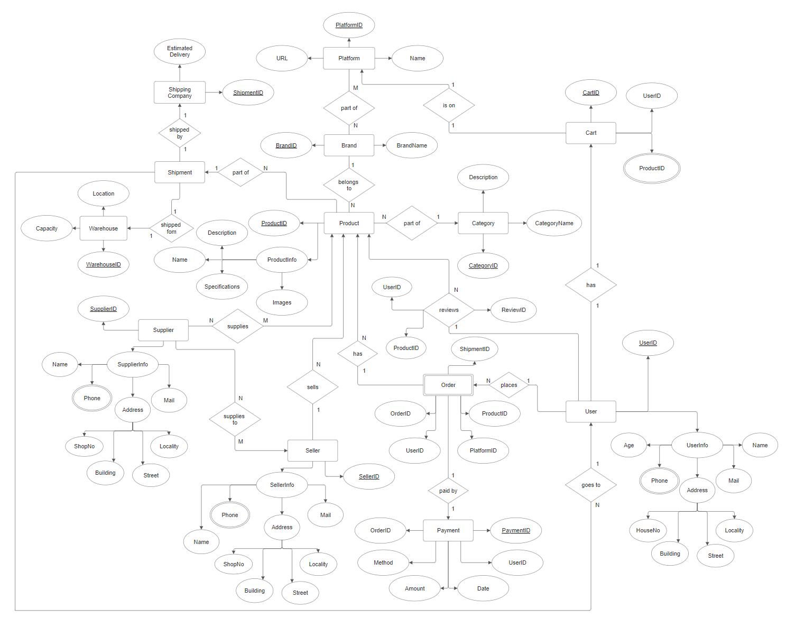

# 🛒 Database Management System for an E-Commerce Platform

A relational database project that models the core business logic of an online shopping
platform — users, products, brands, categories, sellers, suppliers, carts, orders,
payments, warehouses, and shipments — designed in MySQL and normalized to **3NF**.

> Built as a DBMS course project by **Priyanshu Jha, Dhruv Marwal, and Shivang Jain**
> (B.Tech AI & Data Science, MPSTME, NMIMS Mumbai).

---

## 📌 Overview

E-commerce platforms need a database that can cleanly track *who* is buying *what*,
*who* is selling and supplying it, *how* it's paid for, and *how* it gets shipped —
without duplicating data. This project designs a relational schema for exactly that,
starting from an Entity-Relationship Diagram (ERD) and implementing it as a full
MySQL schema with sample data and analytical queries.

**Goals:**
- Minimize redundancy through normalization (3NF)
- Maintain referential integrity via primary/foreign keys
- Support real e-commerce operations: browsing, cart, checkout, shipment, payment
- Answer common business questions (top orders, best sellers, revenue by platform, etc.) with SQL

---

## 🧩 Entity-Relationship Diagram



The ERD captures 15 entities and the relationships between them, including several
many-to-many relationships resolved through junction/bridge tables (`Product_Supplier`,
`Seller_Product`).

---

## 🗂️ Full Table Schemas

Every table exactly as defined in `sql/schema_and_queries.sql`, with column, data type,
and constraint for each field.

### `User`
| Column | Type | Constraint |
|---|---|---|
| UserID | INT | **PRIMARY KEY** |
| Name | VARCHAR(100) | |
| Age | INT | |
| Mail | VARCHAR(100) | |
| Phone | VARCHAR(15) | |

### `UserInfo`
| Column | Type | Constraint |
|---|---|---|
| UserID | INT | **FK → User(UserID)** |
| HouseNo | VARCHAR(20) | |
| Street | VARCHAR(100) | |
| Locality | VARCHAR(100) | |
| Building | VARCHAR(100) | |

### `ProductInfo`
| Column | Type | Constraint |
|---|---|---|
| ProductInfoID | INT | **PRIMARY KEY** |
| Name | VARCHAR(100) | |
| Description | TEXT | |
| Specifications | TEXT | |
| Images | TEXT | |

### `Platform`
| Column | Type | Constraint |
|---|---|---|
| PlatformID | INT | **PRIMARY KEY** |
| Name | VARCHAR(100) | |
| URL | VARCHAR(255) | |

### `Brand`
| Column | Type | Constraint |
|---|---|---|
| BrandID | INT | **PRIMARY KEY** |
| BrandName | VARCHAR(100) | |
| PlatformID | INT | **FK → Platform(PlatformID)** |

### `Category`
| Column | Type | Constraint |
|---|---|---|
| CategoryID | INT | **PRIMARY KEY** |
| CategoryName | VARCHAR(100) | |
| Description | TEXT | |

### `Product`
| Column | Type | Constraint |
|---|---|---|
| ProductID | INT | **PRIMARY KEY** |
| ProductInfoID | INT | **FK → ProductInfo(ProductInfoID)** |
| CategoryID | INT | **FK → Category(CategoryID)** |
| BrandID | INT | **FK → Brand(BrandID)** |

### `Cart`
| Column | Type | Constraint |
|---|---|---|
| CartID | INT | **PRIMARY KEY** |
| UserID | INT | **FK → User(UserID)** |
| ProductID | INT | **FK → Product(ProductID)** |

### `Review`
| Column | Type | Constraint |
|---|---|---|
| ReviewID | INT | **PRIMARY KEY** |
| UserID | INT | **FK → User(UserID)** |
| ProductID | INT | **FK → Product(ProductID)** |

### `Warehouse`
| Column | Type | Constraint |
|---|---|---|
| WarehouseID | INT | **PRIMARY KEY** |
| Location | VARCHAR(100) | |
| Capacity | INT | |

### `Shipment`
| Column | Type | Constraint |
|---|---|---|
| ShipmentID | INT | **PRIMARY KEY** |
| ShippingCompany | VARCHAR(100) | |
| EstimatedDelivery | DATE | |
| WarehouseID | INT | **FK → Warehouse(WarehouseID)** |

### `Order`
| Column | Type | Constraint |
|---|---|---|
| OrderID | INT | **PRIMARY KEY** |
| UserID | INT | **FK → User(UserID)** |
| ProductID | INT | **FK → Product(ProductID)** |
| PlatformID | INT | **FK → Platform(PlatformID)** |
| ShipmentID | INT | **FK → Shipment(ShipmentID)** |

> Note: `Order` is a reserved SQL keyword, so it's backtick-quoted (`` `Order` ``) everywhere in the script.

### `Payment`
| Column | Type | Constraint |
|---|---|---|
| PaymentID | INT | **PRIMARY KEY** |
| OrderID | INT | **FK → Order(OrderID)** |
| Method | VARCHAR(50) | |
| Amount | DECIMAL(10,2) | |
| Date | DATE | |
| UserID | INT | **FK → User(UserID)** |

### `Supplier`
| Column | Type | Constraint |
|---|---|---|
| SupplierID | INT | **PRIMARY KEY** |
| Name | VARCHAR(100) | |
| Phone | VARCHAR(15) | |
| Mail | VARCHAR(100) | |

### `SupplierInfo`
| Column | Type | Constraint |
|---|---|---|
| SupplierID | INT | **FK → Supplier(SupplierID)** |
| ShopNo | VARCHAR(20) | |
| Street | VARCHAR(100) | |
| Locality | VARCHAR(100) | |
| Building | VARCHAR(100) | |

### `Seller`
| Column | Type | Constraint |
|---|---|---|
| SellerID | INT | **PRIMARY KEY** |
| Name | VARCHAR(100) | |
| Phone | VARCHAR(15) | |
| Mail | VARCHAR(100) | |

### `SellerInfo`
| Column | Type | Constraint |
|---|---|---|
| SellerID | INT | **FK → Seller(SellerID)** |
| ShopNo | VARCHAR(20) | |
| Street | VARCHAR(100) | |
| Locality | VARCHAR(100) | |
| Building | VARCHAR(100) | |

### `Product_Supplier` (M:N junction)
| Column | Type | Constraint |
|---|---|---|
| ProductID | INT | **PK (composite), FK → Product(ProductID)** |
| SupplierID | INT | **PK (composite), FK → Supplier(SupplierID)** |

### `Seller_Product` (M:N junction)
| Column | Type | Constraint |
|---|---|---|
| SellerID | INT | **PK (composite), FK → Seller(SellerID)** |
| ProductID | INT | **PK (composite), FK → Product(ProductID)** |

---

## 🔗 Relationships

| Relationship | Cardinality | Description |
|---|---|---|
| User → Order | 1:N | A user can place many orders |
| User → Cart | 1:N | A user's cart can hold many products |
| User → Review | 1:N | A user can leave many reviews |
| User → UserInfo | 1:1 | Each user has one address record |
| Order → Payment | 1:1 | Each order is paid for once |
| Order → Shipment | N:1 | Many orders can share a shipment batch |
| Order → Platform | N:1 | Orders are placed on a specific platform |
| Product → ProductInfo | N:1 | Product record points to shared catalog/description data |
| Product → Category | N:1 | Each product belongs to one category |
| Product → Brand | N:1 | Each product belongs to one brand |
| Brand → Platform | N:1 | Each brand is tied to a platform |
| Product ↔ Supplier | **M:N** (via `Product_Supplier`) | A product can come from multiple suppliers; a supplier can supply multiple products |
| Product ↔ Seller | **M:N** (via `Seller_Product`) | A product can be listed by multiple sellers; a seller can list multiple products |
| Shipment → Warehouse | N:1 | A shipment originates from a warehouse |
| Supplier → SupplierInfo | 1:1 | Address split out for normalization |
| Seller → SellerInfo | 1:1 | Address split out for normalization |

**Why the M:N junction tables matter:** `Product_Supplier` and `Seller_Product` are the
classic fix for many-to-many relationships in a relational model — instead of repeating
supplier/seller info inside `Product`, each junction table stores just the pair of
foreign keys, keeping the schema in 3NF.

---

## 🏗️ Repository Structure

```
├── README.md                     # You are here
├── images/
│   └── ERD.png                   # Entity-Relationship Diagram
├── sql/
│   └── schema_and_queries.sql    # Full schema, sample data, and analytical queries
└── docs/
    └── DBMS-Report.pdf           # Full project report (methodology, results, conclusion)
```

---

## ⚙️ Setup / How to Run

1. Install MySQL (or MariaDB) and a client such as MySQL Workbench or the `mysql` CLI.
2. Clone this repo:
   ```bash
   git clone https://github.com/<your-username>/<your-repo-name>.git
   cd <your-repo-name>
   ```
3. Run the schema + sample data:
   ```bash
   mysql -u root -p < sql/schema_and_queries.sql
   ```
   This creates the `ecom` database, all 19 tables, inserts sample rows, and runs the
   analytical queries below.
4. Explore: `USE ecom; SHOW TABLES;`

---

## 📊 Sample Analytical Queries

The schema is exercised with real business questions. A few highlights (full list in
`sql/schema_and_queries.sql`):

1. **Top 3 most expensive orders** — joins `Order → User → Product → ProductInfo → Payment`, sorted by `Amount DESC`.
2. **Sellers selling in the "Laptops" category** — `Seller → Seller_Product → Product → Category`.
3. **Total revenue per platform** — `Order → Platform` + `Payment`, grouped and summed.
4. **Most active users by order count** — `User → Order`, grouped, sorted descending.
5. **Suppliers by number of unique products supplied** — uses the `Product_Supplier` junction table with `COUNT(DISTINCT ...)`.
6. **Warehouses with pending shipments** — `Warehouse → Shipment`, grouped.
7. **Users who both purchased and reviewed the same product** — a self-consistency check joining `Order` and `Review` on matching `UserID` + `ProductID`.
8. **Average order value by category** — `Order → Payment` + `Product → Category`, averaged.
9. **Product with the most orders, plus its supplier & seller info** — uses a nested subquery to find the max order count, then joins across both `Product_Supplier` and `Seller_Product`.
10. **Products shipping between two dates** — filters `Shipment.EstimatedDelivery` with `BETWEEN`.

---

## 📈 Results

The schema is normalized to **Third Normal Form (3NF)**, removing repeating groups and
transitive dependencies (e.g., splitting address data into `UserInfo`/`SupplierInfo`/
`SellerInfo`, and product descriptions into `ProductInfo`). This keeps data redundancy
low while still supporting fast, join-based analytical queries.

## 🚀 Future Scope

- AI-based personalized product recommendations
- Blockchain-based secure transactions
- Multi-vendor / international marketplace scalability
- Real-time analytics on user behavior

## ⚠️ Limitations

- No detailed inventory replenishment mechanism yet
- Real-time warehouse stock syncing across platforms needs further optimization
---

## 👤 Authors

- GitHub: [Dhruv Marwal](https://github.com/DhruvMarwal) , [Priyanshu Jha](https://github.com/Priyanshu0423) , [Shivang Jain](https://github.com/Xopse)
- LinkedIn: [Dhruv Marwal](https://linkedin.com/in/dhruvmarwal) , [Priyanshu Jha](https://linkedin.com/in/priyanshujha-) , [Shivang Jain](https://linkedin.com/in/shivang-jain-69602132a)
---
